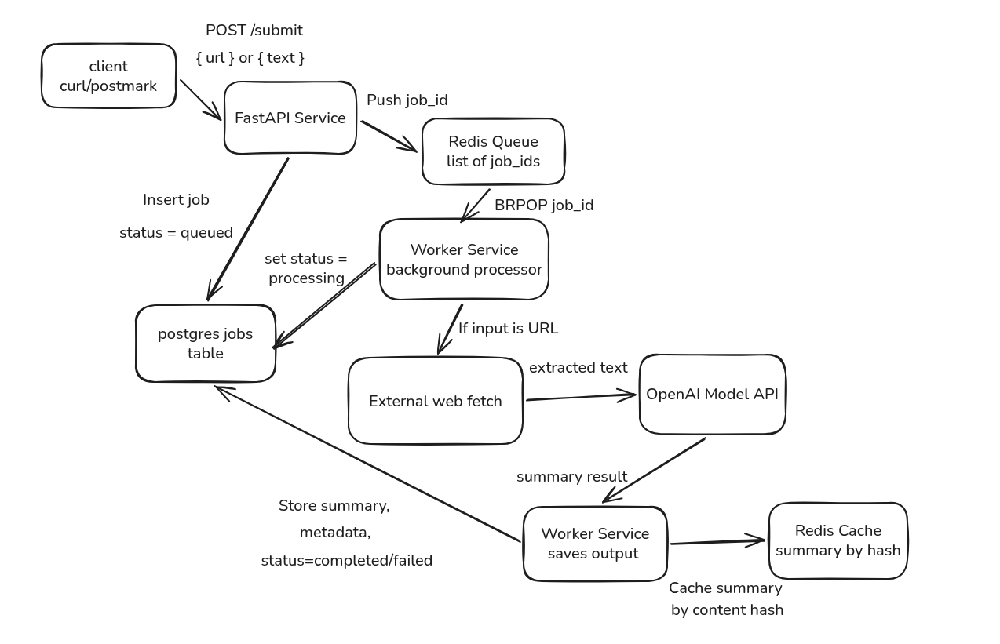

## Async Content Summarizer

### Architecture



### Local (Docker Compose)

- Copy env: `cp .env.example .env` and fill values
- Start: `docker compose up --build`
- Migrate: `docker compose run --rm -e PYTHONPATH=/app api alembic -c alembic.ini upgrade head`
- API docs: `http://localhost:8000/docs`

### Environment variables

- `DATABASE_URL`
- `REDIS_URL`
- `OPENAI_API_KEY` (optional)
- `OPENAI_MODEL` (optional, default `gpt-4o-mini`)
- `OPENAI_TIMEOUT_SECONDS` (optional)

### Demo (curl)

Submit:

```bash
curl -sS -X POST http://localhost:8000/submit \
  -H 'Content-Type: application/json' \
  -d '{"text":""}'
```

Poll:

```bash
curl -sS http://localhost:8000/status/<job_id>
```

Result:

```bash
curl -sS http://localhost:8000/result/<job_id>
```

Duplicate (cache hit on second submit):

```bash
curl -sS -X POST http://localhost:8000/submit -H 'Content-Type: application/json' -d '{"text":"duplicate"}'
curl -sS -X POST http://localhost:8000/submit -H 'Content-Type: application/json' -d '{"text":"duplicate"}'
```

### Tests

```bash
pytest -q
```

### Local (without Docker)

- Install: `pip install -r requirements.txt`
- Run API: `uvicorn app.main:app --reload --port 8000`
- Health: `GET /health`